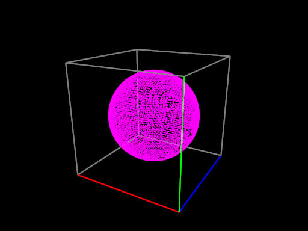

# ImplicitGrapher

Solves and plots solutions of 3D implicit functions!

## Intro

ImplicitGrapher is a simple Python tool for visualizing the level sets of [3D implicit functions](https://en.wikipedia.org/wiki/Implicit_surface).  For example, a sphere at the origin is implicitly defined by the function:

    x² + y² + z² - r² = 0

ImplicitGrapher numerically solves the function over the given domain, displaying an interactive 3D graph of the reconstructed surface:

Although a sphere is easy to plot in other ways, more complex functions are of course more difficult:

    2 z (z² - 3 x²)(1 - y²) + (x² + z²)² - (2 y² - 1)(1 - y²) = 0

Produces:

Any surface you can describe this way can be rendered.  As a final example, consider the [Mandelbulb](https://en.wikipedia.org/wiki/Mandelbulb)—an infinitely complex fractal surface:

## Usage

ImplicitGrapher is designed to be very easy to use.  Write a definition of your function in a Python file, and then point ImplicitGrapher to it in the "[settings.txt](settings.txt)" file, with the desired bounds.  Some examples are provided in "[examples/](examples/)".

The graph can be inspected with the mouse.  Press "G" to visualize the subdivision lattice, and "P" to visualize the distance field's sign on the lattice.

## How It Works

ImplicitGrapher initially sparsely samples the space at the vertices of a rectangular lattice.  Surfaces are detected when they pass between lattice points, since the sign of the surface's level set changes between the points.

When a surface is detected, the lattice is subdivided and the process repeated recursively up to some limit.  To improve the results and ameliorate undersampling, subdivision is restricted to be "smooth"—orthogonal neighbors cannot differ by more than one subdivision level.  In such a case, the grid is subdivided until smoothness is re-attained.

The surface is reconstructed by simple dots, which are linearly interpolated along lattice edges until they are expected to lie on the surface.

The whole procedure is similar to marching cubes.

## Contributing and Licensing

Contributions and bug reports are welcome.  Free for use, including commercial, with attribution.
